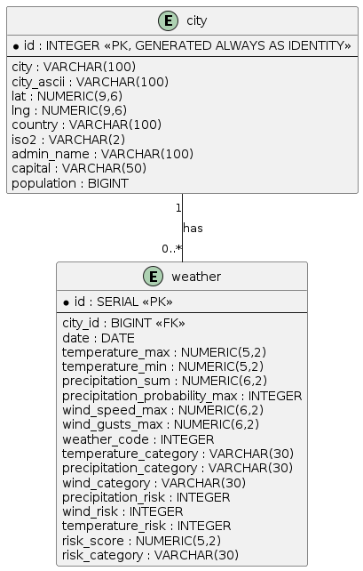

# 🌦️ Weather Decision Support Data Pipeline

> **End-to-End Data Pipeline for Weather Risk Analysis in Moroccan Cities**

## 📌 Project Overview

This project implements an end-to-end data pipeline designed to help a Moroccan logistics and delivery company anticipate weather-related operational risks.

Weather conditions such as **heavy precipitation, strong winds, and extreme temperatures** can affect delivery operations, schedules, and transportation conditions.

The pipeline collects weather forecasts for Moroccan cities, transforms and validates the data through multiple processing layers, calculates a **Weather Risk Score**, stores the processed data in PostgreSQL, and provides the foundation for business-oriented analysis and decision support.

### Business Question

> **Which cities and periods present the highest weather-related risks during the upcoming days?**

The final dataset allows decision-makers to:

* Compare weather conditions between cities.
* Identify periods with higher operational risk.
* Monitor precipitation, wind, and temperature conditions.
* Prioritize cities requiring additional attention.
* Support operational planning and delivery decisions.

---

# 🏗️ Architecture

The project follows a **Bronze → Silver → Gold** data architecture.

```text
                         ┌─────────────────────┐
                         │   Moroccan Cities   │
                         │      CSV Source     │
                         └──────────┬──────────┘
                                    │
                                    ▼
                         ┌─────────────────────┐
                         │   Open-Meteo API    │
                         │  Weather Forecasts  │
                         └──────────┬──────────┘
                                    │
                                    ▼
                         ┌─────────────────────┐
                         │       BRONZE        │
                         │   Raw Source Data   │
                         │                     │
                         │ cities.csv          │
                         │ weather.json        │
                         └──────────┬──────────┘
                                    │
                                    ▼
                         ┌─────────────────────┐
                         │       SILVER        │
                         │ Cleaning &           │
                         │ Standardization     │
                         │                     │
                         │ weather_clean.csv   │
                         └──────────┬──────────┘
                                    │
                                    ▼
                         ┌─────────────────────┐
                         │        GOLD         │
                         │ Feature Engineering │
                         │ & Risk Calculation  │
                         │                     │
                         │ weather_gold.csv    │
                         └──────────┬──────────┘
                                    │
                                    ▼
                         ┌─────────────────────┐
                         │     PostgreSQL      │
                         │   Data Warehouse    │
                         └──────────┬──────────┘
                                    │
                     ┌──────────────┴──────────────┐
                     ▼                             ▼
             ┌─────────────────┐          ┌─────────────────┐
             │ SQL Analysis    │          │   Dashboard     │
             │ Business Queries│          │   & Reporting   │
             └─────────────────┘          └─────────────────┘

                         ▲
                         │
                  ┌──────┴──────┐
                  │   Airflow   │
                  │ Orchestration│
                  └─────────────┘
```

---

# 📂 Project Structure

```text
.
├── dags/
│   └── main.py
│
├── data/
│   ├── bronze/
│   │   ├── cities/
│   │   │   └── cities.csv
│   │   └── weather/
│   │       └── weather.json
│   │
│   ├── silver/
│   │   └── weather_clean.csv
│   │
│   └── gold/
│       └── weather_gold.csv
│
├── extraction/
│   └── bronze.py
│
├── transformation/
│   ├── silver.py
│   └── gold.py
│
├── load/
│   └── load.py
│
├── sql/
│   ├── init.sql
│   └── schema.sql
│
├── sources/
│   └── ma.csv
│
├── UML/
│   └── UML.png
│
├── Dockerfile
├── Dockerfile.airflow
├── docker-compose.yml
├── requirements.txt
└── README.md
```

---

# 🔄 Data Pipeline

## 1. Extraction — Bronze

The extraction layer retrieves data from two sources:

### Moroccan Cities Dataset

The project uses a CSV dataset containing Moroccan cities and geographical information such as:

* City name
* Latitude
* Longitude
* Country
* Administrative information
* Population

The resulting city dataset is stored in:

```text
data/bronze/cities/cities.csv
```

### Open-Meteo API

The geographical coordinates of each city are used to request weather forecasts from the **Open-Meteo API**.

The pipeline retrieves daily forecast information including:

* Maximum temperature
* Minimum temperature
* Precipitation sum
* Maximum precipitation probability
* Maximum wind speed
* Maximum wind gusts
* Weather code

The raw API responses are preserved in:

```text
data/bronze/weather/weather.json
```

The Bronze layer keeps the source data as close as possible to its original structure.

---

# 🧹 2. Transformation — Silver

The Silver layer prepares the raw weather data for analysis.

The nested `daily` structure returned by the API is transformed into a tabular format where:

> **One row represents one city for one forecast date.**

For example:

```text
city        date        temperature_max   temperature_min   precipitation
Casablanca  2026-09-18  24.6              18.8              0.0
Casablanca  2026-09-19  26.7              19.3              0.0
...
```

The Silver transformation includes:

* Flattening the nested weather structure.
* Standardizing the date field.
* Converting data into a tabular DataFrame.
* Removing duplicate records.
* Preparing the data for feature engineering.

Output:

```text
data/silver/weather_clean.csv
```

Implementation:

```text
transformation/silver.py
```

---

# 📊 3. Transformation — Gold

The Gold layer contains business-oriented data prepared for decision support.

This layer enriches the Silver dataset with weather indicators and risk-related features.

The pipeline calculates a:

## Weather Risk Score

The risk score combines the main weather factors that can affect delivery operations:

* Precipitation
* Wind
* Temperature

The resulting score is used to classify weather conditions into risk levels.

The Gold dataset is stored in:

```text
data/gold/weather_gold.csv
```

Implementation:

```text
transformation/gold.py
```

---

# 🗄️ 4. Data Loading

The processed Gold data is loaded into **PostgreSQL** for persistent storage and business analysis.

The database contains structured weather and city information designed to support:

* Historical and forecast analysis.
* City comparisons.
* Risk analysis.
* SQL business queries.
* Dashboard consumption.

Database scripts:

```text
sql/init.sql
sql/schema.sql
```

Loading implementation:

```text
load/load.py
```

---

# 🔎 5. SQL Analysis

The project includes SQL queries designed to answer business questions from the processed weather data.

Examples of supported analyses include:

* Which cities have the highest temperatures?
* Which cities have the highest precipitation?
* Which cities have the highest average weather risk?
* Which forecast periods have the highest risk?
* What is the highest-risk period for each city?

SQL files:

```text
sql/
├── init.sql
└── schema.sql
```

---

# ⚙️ 6. Airflow Orchestration

Apache Airflow is used to automate and orchestrate the pipeline.

The DAG coordinates the different stages of the workflow:

```text
Extraction
    ↓
Silver Transformation
    ↓
Gold Transformation
    ↓
PostgreSQL Load
```

Airflow implementation:

```text
dags/main.py
```

The Airflow environment is configured using:

```text
Dockerfile.airflow
```

---

# 🐳 7. Docker

The project is designed to run in a containerized environment.

Docker is used to provide reproducible environments for the application and data infrastructure.

Main Docker files:

```text
Dockerfile
Dockerfile.airflow
docker-compose.yml
```

The architecture can include the following services:

```text
┌─────────────────┐
│     Airflow     │
│  Orchestration  │
└────────┬────────┘
         │
         ▼
┌─────────────────┐
│   Python App    │
│ ETL Processing  │
└────────┬────────┘
         │
         ▼
┌─────────────────┐
│   PostgreSQL    │
│   Data Storage  │
└─────────────────┘
```

---

# 🛠️ Technologies

| Technology     | Purpose                              |
| -------------- | ------------------------------------ |
| Python         | Data pipeline development            |
| Pandas         | Data manipulation and transformation |
| NumPy          | Numerical processing                 |
| Requests       | API communication                    |
| Open-Meteo API | Weather forecast data                |
| PostgreSQL     | Data storage and analysis            |
| SQL            | Business analysis                    |
| Apache Airflow | Pipeline orchestration               |
| Docker         | Containerization                     |
| Streamlit      | Dashboard / data visualization       |
| Git            | Version control                      |

---

# 🚀 Installation & Execution

## Prerequisites

Make sure the following tools are installed:

* Docker
* Docker Compose
* Git

Clone the repository:

```bash
git clone https://github.com/yakhlafhoussam/Weather-Pipeline.git
cd Weather-Pipeline
```

---

## Start the project

Build the Docker images:

```bash
docker compose build
```

Start the services:

```bash
docker compose up -d
```

Check running containers:

```bash
docker compose ps
```

View logs:

```bash
docker compose logs -f
```

---

# ▶️ Running the Pipeline

The pipeline follows this order:

```text
1. Extract
      ↓
2. Bronze
      ↓
3. Silver
      ↓
4. Gold
      ↓
5. PostgreSQL
      ↓
6. SQL Analysis
```

The individual components can be found in:

```text
extraction/
transformation/
load/
sql/
```

Airflow is responsible for orchestrating the workflow automatically.

---

# 🧪 Data Quality

Data quality is considered at multiple stages of the pipeline.

### Bronze

The raw data is preserved without unnecessary modifications.

### Silver

The pipeline performs transformations such as:

* Date standardization.
* Type normalization.
* Duplicate detection/removal.
* Structural validation.
* Preparation of clean tabular data.

### Gold

The transformed data is enriched with:

* Weather categories.
* Risk indicators.
* Weather Risk Score.
* Business-oriented features.

---

# 📈 Business Value

The pipeline transforms raw weather forecasts into information that can support logistics decision-making.

Instead of looking directly at raw API responses, users can answer questions such as:

```text
Where is the weather risk highest?

When are the most risky forecast periods?

Which cities require additional attention?

What weather factors contribute to the risk?
```

This allows weather information to become an input for operational planning.

---

# 🗺️ UML

The project architecture and data flow are documented in:



The UML diagram represents the main components and relationships of the data pipeline.

---

# 📁 Data Layers

| Layer  | Location       | Purpose                        |
| ------ | -------------- | ------------------------------ |
| Bronze | `data/bronze/` | Raw extracted data             |
| Silver | `data/silver/` | Cleaned and standardized data  |
| Gold   | `data/gold/`   | Business-ready analytical data |

---

# 🔐 Data & API

The project uses the Open-Meteo weather API for forecast data.

No sensitive personal data is required by the pipeline.

---

# 👨‍💻 Project Organization

```text
Extraction
    → Retrieve source data and weather forecasts

Transformation
    → Clean, validate and enrich the data

Load
    → Store processed data in PostgreSQL

SQL
    → Perform business analysis

Airflow
    → Automate and orchestrate the pipeline
```

---

# 🎯 Project Objective

The main objective is to demonstrate the construction of a complete data engineering pipeline capable of transforming raw external data into actionable information.

The project covers the complete workflow:

> **Extract → Store → Transform → Enrich → Load → Analyze → Orchestrate**

---

# 📌 Project Status

| Component              | Status |
| ---------------------- | ------ |
| City data extraction   | ✅      |
| Weather API extraction | ✅      |
| Bronze layer           | ✅      |
| Silver transformation  | ✅      |
| Gold transformation    | ✅      |
| PostgreSQL loading     | ✅      |
| SQL analysis           | ✅      |
| Airflow orchestration  | ✅      |
| UML                    | ✅      |

---

# 📜 License

This project was developed for educational purposes as part of a data engineering project at **YouCode Safi**.
